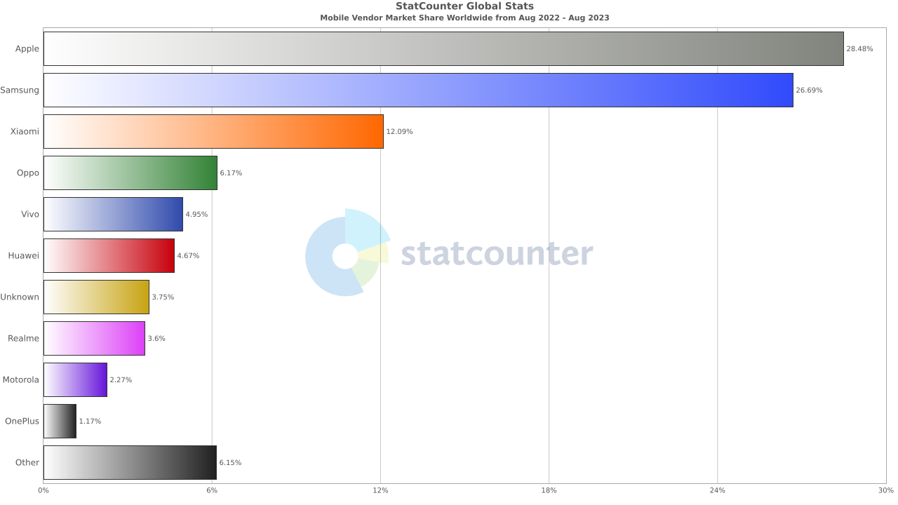
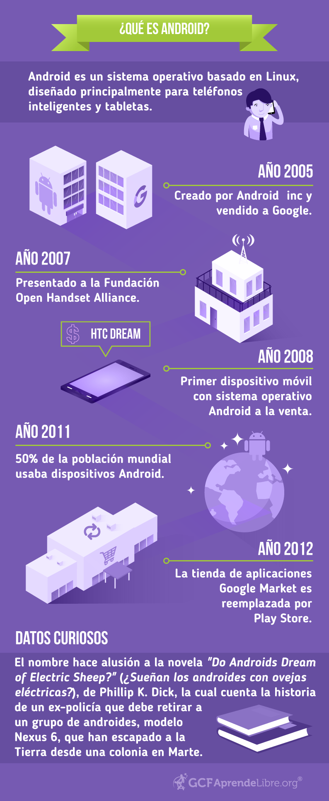

## 1. INTRODUCCIÓ (Descripción general del treball)

El proyecto está  enfocado a realizar una búsqueda en línea y a aprender a buscar información del ámbito dado que como programadores debemos aprender a leer documentación y saber extraer la información correcta al momento de utilizarla.

También nos ayudará a tener un mejor conocimiento de lo que vamos a aprender durante el  curso dado que es algo importante al momento de trabajar con un stack nuevo. 
  
## 2. TIPUS DE DISPOSITUS MÒBILS (smartphones, tablets, smartwatch ...)

### Smartphones

Los smartphones o (dispositivos inteligentes), lo que lo hace "inteligente" es el hecho de que puedes realizar muchas funciones a la vez.   

Nos proporciona una capacidad de almacenamiento y procesamiento alto, actualmente se asemeja bastante a un ordenador dado que tienen un rendimiento realmente alto.

### Tablets 

También llamado tableta, es un dispositivo electrónico portátil de un tamaño similar al de un smartphone.  

Son ordenadores portátiles personales integrados en una pantalla táctil, con acceso a Internet y con capacidad para ejecutar aplicaciones instaladas sobre un sistema operativo. Su manejo es fácil e intuitivo.

### Relojes inteligentes (Smartwatch)

Es un reloj de pulsera el cual tiene una pantalla táctil , con acceso a internet, y poder recibir llamadas y/o enviar mensajes.

### Television

Tenemos las tv que actualmente tienen un sistema operativo desarrollado por Google, tienen una plataforma inteligente que ofrece una experiencia interactiva con el usuario, con lo cual podemos conectar nuestros dispositivos móviles o portátiles.

## 3. FABRICANTS (Apple, Samsung, Motorola, Lenovo...)

Basándonos en la estadística de StatCounter de Agosto de 2022 hasta Agosto de 2023. [Apple](#Apple) y [Samsung](#Samsung) son los dos proveedores líderes en el mundo de la telefonía móvil.

Apple con un 28,48% seguido de Samsung con un 26,69% de cuota de mercado de teléfonos móviles.

### Apple

Está a la vanguardia con productos innovadores que marcan tendencia en el mercado, es uno de los mejores dispositivos de hardware. 
Esta calidad de fabricación está respaldada por la experiencia de usuario, la estabilidad y la solidez de la plataforma iOS de la compañía.

### Samsung

Los teléfonos móviles de Samsung ofrecen algunas de las tecnologías más avanzadas en el mercado. 
Entre sus características más importantes sus pantallas super AMOLED, modo de cámara profesional, almacenamiento expandible, etc.

### Xiaomi 

Ofrece productos de alta tecnología que se caracterizan por ser modernos, simples, resistentes, de excelente calidad y que, además, no cuestan una fortuna.

### Motorola

Productos de calidad, diseños innovadores e intuitivos y, sobre todo, un valor excelente en la duración de sus baterías, también un excelente servicio al cliente.

### Oppo 

Es una de las mejores marcas de móviles, ya que posee una larga trayectoria en el desarrollo de dispositivos móviles.
Estos teléfonos ofrecen características avanzadas como procesadores potentes, memoria RAM eficiente, baterías de larga duración y pantallas de excelente claridad.

### Huawei 

Tiene una buena reputación que se debe a la gran resistencia y los materiales de construcción de su hardware, que le permiten resistir mucho mejor los elementos externos y el uso prolongado sin presentar un deterioro significativo.

## 4. MODELS Més venuts (Iphone, iPad, galaxy watch…)

Lista de móviles más vendidos a nivel mundial en el primer semestre de 2023 realizado por la empresa [omdia](https://omdia.tech.informa.com/).

La clasificación incluye dispositivos de Samsung y Apple por partes iguales, con 5 modelos Galaxy y otros 5 iPhone. 
Esta serie de equipos componen la lista de los que mayor volumen de ventas han tenido entre los meses entre __Enero y Junio de 2023__ a nivel global.

Un listado que evidencia el poder tecnológico de ambas empresas en lo que a telefonía inteligente se refiere.

|           Modelo         |  Marca  | Cantidad Ventas |
| ------------------------ | ------- | --------------- |
| iPhone 14 Pro Max        | Apple   | 26.5 millones   |
| iPhone 14 Pro            | Apple   | 21 millones     |
| iPhone 14                | Apple   | 16.5 millones   |
| iPhone 13                | Apple   | 15.5 millones   |
| Samsung Galaxy A14       | Samsung | 12.4 millones   |
| Samsung Galaxy S23 Ultra | Samsung | 9.6 millones    |
| Samsung Galaxy A14 5G    | Samsung | 9 millones      |
| Samsung Galaxy A54 5G    | Samsung | 8.8 millones    |
| Samsung Galaxy A34 5G    | Samsung | 7.1 millones    |
| iPhone 11                | Apple   | 6.9 millones    |

## 5. HISTÒRIA / EVOLUCIÓ (des de els primers smartphones fins avui)

  
  

## 6. SISTEMES OPERATIUS (Android, iOS, tizen...)

Android domina el panorama internacional de los sistemas operativos móviles con una cuota de mercado del 71 por ciento, principalmente en Europa, Asia, América y África, mientras que Apple representa el 28 por ciento.  

[Android](#^e641d6) e [iOS ](#^40b6d9) son los dos sistemas operativos móviles dominantes, pese a la existencia de otras propuestas como HarmonyOS, de Huawei, acaparando ambos el 99 por ciento del mercado, según datos de [StatCounter](https://gs.statcounter.com/os-market-share/mobile/worldwide) de Enero de 2022 a Enero de 2023.

### Android
^e641d6

Es decir, se trata de todo aquello que puedes ver y con lo que puedes interactuar desde la pantalla de tu equipo.

Android es un sistema operativo basado en Linux, diseñado principalmente para smarthphones y tabletas.

### iOS 
^40b6d9

iOS es un sistema operativo lanzado y utilizado por Apple. Su nombre proviene de iPhone OS. 
Es decir, **i**Phone **O**perative **S**ystem. Utilizando las siglas, iOS. 

Se lanzó originalmente para el teléfono de la marca, aunque también se ha utilizado durante años en otros dispositivos de la compañía como en algunos de los reproductores de música iPod o en las tabletas iPad.

Se trata de un sistema cerrado que no puedes utilizar salvo en dispositivos de marca Apple. 

La gran diferencia entre iOS y Android es que el sistema operativo de Google puede instalarse en infinidad de teléfonos de todas las marcas, pero iOS es un sistema cerrado y exclusivo. 

## 7. TECNOLOGIES ( 4G, 5G, WIFI, NFC, Bluetooth…)

### 4G
#### Qué es 4G?

La cuarta generación de tecnología en telecomunicaciones móviles, abreviado comúnmente como 4G, es prácticamente un estándar aplicado al mercado móvil.

Los requisitos son dados por el Sector de Normalización de las Radiocomunicaciones de la **[Unión Internacional de Telecomunicaciones](http://es.wikipedia.org/wiki/Uni%C3%B3n_Internacional_de_Telecomunicaciones)** (ITU, por sus siglas en inglés), quienes tienen como tarea el regular la mayor parte del espectro radioeléctrico.

Para que se cumpla que estamos utilizando el 4G, se tiene que **alcanzar en movimiento una velocidad de 100Mb/s**, ha de estar **todo basado en IP**, y la **latencia tenía que ser menor de 10ms**.

### 5G
#### Qué es 5G ?

El 5G hace referencia a la quinta generación de tecnología de comunicaciones inalámbricas, que permite la conexión a la red de múltiples dispositivos. Se trata de una continuación y mejora del 4G (o LTE) que favorece, entre otras cosas, **la velocidad de conexión y transmisión de datos.** 

Las redes 5G también **amplían el nivel de cobertura** y la capacidad de comunicación a tiempo real entre distintos dispositivos, además de **reducir la latencia**, es decir, el tiempo de respuesta web a un milisegundo.

#### Ventajas

- **Aumento de la velocidad de la red:** El 5G supera los 10 GB por segundo, respecto a 1GB por segundo de las redes 4G.

- **Aumento de dispositivos conectados:** Con el 5G es posible mantener más de 1 millón de dispositivos por kilómetro cuadrado, a diferencia de los 100.000 que pueden conectarse con 4G. Todo esto gracias a la tecnología Mimo (_Multiple-Input Multiple-Output,por sus siglas en inglés), que permite la conexión en tiempo real y contemporánea de múltiples dispositivos.

- **Reducción de la latencia:** Con el 5G se reduce hasta a 1 milisegundo el tiempo que los datos tardan en recorrer la distancia entre emisor y receptor.

- **Mejora del ancho de banda:** Esto significa que la capacidad de la red y la transmisión del volumen de datos aumenta, lo que se traduce en mejor cobertura independientemente de la ubicación, mayor conectividad y mejor rendimiento para un mayor número de usuarios.

### WIFI
#### Que es WIFI ?

WiFi es el nombre que recibe una familia de protocolos de red inalámbrica que permiten a los dispositivos electrónicos modernos conectarse de forma inalámbrica a un router habilitado para WiFi con el fin de acceder a Internet.

#### Como funciona?

Las redes WiFi transmiten información por el aire utilizando ondas de radio, que son un tipo de radiación electromagnética con longitudes de onda en el espectro electromagnético más largas que la luz infrarroja.

Las ondas de radio WiFi suelen tener la frecuencia de [2,4 gigahercios o 5,8 gigahercios](https://www.netspotapp.com/es/blog/all-about-wifi/why-a-router-has-two-wifi-frequency-bands.html#2_4GHz_vs_5GHz_WiFi). 

Estas dos bandas de frecuencia WiFi se subdividen en múltiples canales, siendo cada canal posiblemente compartido por muchas redes diferentes.

Cuando descarga un archivo a través de una red WiFi, un dispositivo conocido como [router inalámbrico](https://www.netspotapp.com/hardware/es/wireless-router/#Que_es_un_router_WiFi) primero recibe los datos de Internet a través de su conexión a Internet de banda ancha y luego los convierte en ondas de radio y el dispositivo inalámbrico que ha iniciado la solicitud de descarga las captura y las decodifica.

### NFC

NFC son las siglas de __Near Field Communication__, lo que traducido al español sería _Comunicación por Campos Cercanos_.

#### Qué es NFC?

Es una tecnología inalámbrica de alta frecuencia y de corto alcance que permite conectar dispositivos para el intercambio de datos. 
Al tener un radio de acción bajo, es necesario que los equipos estén cerca, a 10 o 15 centímetros de distancia para que funcione.

NFC puede funcionar de dos maneras:
- **Modo activo:** Cuando ambos dispositivos cuentan con el chip NFC generan el campo electromagnético para compartir información.
- **Modo pasivo:** Solo uno equipo es activo y el otro no tiene fuente propia de energía, por lo que necesita el campo electromagnético del primero para intercambiar los datos.

### Bluetooth 

En 1994, **Japp Haartsen y Sven Mattiso** comenzaron a desarrollar para Ericsson un sistema de comunicación que no necesitaba cables. Lo llamaron _bluetooth_ en honor al rey Harald Blatand, un monarca vikingo que, en el siglo X, unificó los reinos danés y noruego. Las tribus que habían permanecido separadas, por fin, podían comunicarse.

#### Que es Bluetooth ?

La tecnología Bluetooth permite que los PCs y los dispositivos electrónicos se sincronicen con los periféricos como auriculares, teclados o ratones inalámbricos sin necesidad de utilizar cables o una infraestructura de red compatible.
La tecnología de radio inalámbrica de corto alcance opera en la banda de frecuencia [ISM](https://es.wikipedia.org/wiki/Banda_ISM) de 2,4 GHz. 

#### Como funciona ?

La tecnología _bluetooth_ utiliza ondas de radio en la **banda de frecuencia ISM de 2,4 GHz**. Se trata de bandas no comerciales que, a nivel internacional, tienen usos industriales, médicos y científicos. Emplea redes WPAN, un estándar de comunicación para equipos próximos al punto de acceso. 

Por lo tanto, los dispositivos no pueden estar muy alejados entre sí. Según su radio de alcance, se clasifican en:

- **Clase 1**: Abarcan distancias de hasta 100 m.
- **Clase 2**: Los más habituales. Alcanzan entre 5 y 10 m.
- **Clase 3**: Su alcance máximo es de 1 m.

## 8. TIPUS D'APPS MÉS CONEGUDES/DESCARREGADES 

Apps más descargadas en la plataforma App Store de iOS.

|     App     | Núm Descargas |
| ----------- | ------------- |
| CapCut      | 10 millones   |
| Google Maps | 9 millones    |
| TikTok      | 9 millones    |
| ChatGpt     | 8 millones    |
| Youtube     | 8 millones    |
| Instagram   | 8 millones    |
| Temu        | 7 millones    |
| WhatsApp    | 8 millones    |
| Gmail       | 8 millones    |

Apps más descargadas en la plataforma Play Store de Android.

|     App           | Núm Descargas |
| ----------------- | ------------- |
| Instagram         | 40 millones   |
| Facebook          | 34 millones   |
| TikTok            | 33 millones   |
| WhatsApp          | 27 millones   |
| Snapchat          | 18 millones   |
| Telegram          | 16 millones   |
| WhatsApp Business | 27 millones   |
| CapCut            | 10 millones   |
| Shein             | 8 millones    |
| Spotify           | 7 millones    |

Como podemos observar si comparamos ambas tablas la proporción que abarca Android es totalmente mayor a lo que abarca iOS.

## 9. DESENVOLUPAMENT D'APPS

En el área del desarrollo de creación de aplicaciones móviles tenemos distintos lenguajes de programación a nuestro alcance, donde también importa si es para un tipo de dispositivo o si es para una aplicación multiplataforma.

-  Lenguajes para crear [aplicaciones Android](#^ec92d7) :
- [Java](#^fef5b7)
- [Kotlin](#^dbc17a)
- [C++](#^5cabb7)
- Basic
- Lua

-  Lenguajes para crear [aplicaciones iOS](#^03507b):
- [Swift](#^d53c6f)
- [Objective-C](#^ba5b15)

 - Crear aplicaciones multiplataformas:
- [React Native](#^b84340)
- [Flutter](#^5a41c1)
- Xamarin
- Ionic

Al crear aplicaciones Android los lenguajes de programación más importantes son _Java_ y _kotlin_ si es para crear aplicaciones nativas.

Y para crear aplicaciones en iOS los lenguajes de programación son _Swift_ y _Objective-C_ para crear aplicaciones nativas.

Por otro lado también podemos crear aplicaciones _multiplataforma_ con lenguajes tales como _React Native_, _Flutter_, etc.

|  Lenguaje de Programación |   Plataforma    |
| -----------               | ------------    |
| Java                      | Android         |
| Swift                     | iOS             |
| Kotlin                    | Android         |
| Objective-C               | iOS             |
| React Native              | Multiplataforma |
| C#                        | Android         |
| Flutter                   | Multiplataforma |
| C++                       | Android         |
| Xamarin                   | Multiplataforma |
| Lua                       | Android         |
| Ionic                     | Multiplataforma |
| Rust                      | Multiplataforma |

### 9.1. LLENGUATGES PROGRAMACIÓ

#### Desarrollo de Aplicaciones Android
^ec92d7

##### 1. Java 
^fef5b7

Java se considera un lenguaje de programación elemental para el desarrollo de aplicaciones de Android. James Gosling desarrolló este lenguaje de programación simple, seguro, de propósito general y de subprocesos múltiples en 1995.

###### Características principales

- __Independiente de la plataforma__:
Java, solo necesita escribir el codigo una vez en una plataforma  y puedes utilizarlo en cualquier lugar (Windows, unix, MacOS). 

- __Multihilo__:
El multihilo es otra característica atractiva de Java. Esta característica de Java permite a los desarrolladores realizar varias tareas a la vez manejando los mismos recursos y memoria. 

- __Programación Polyglot mejorada__ :
Esta es una característica avanzada de Java que forma parte de Java 8. Polyglot básicamente permite a los usuarios escribir el código en distintos lenguajes de programación. 

- __Seguro__: 
Con seguridad a nivel de biblioteca y verificación en tiempo de compilación, Java es uno de los lenguajes de programación de Android más seguros. JVM, sistema libre de manipulaciones, Sandbox, protección criptográfica y ClassLoader también hacen de Java un lenguaje invulnerable. 

- __Inconvenientes de usar el lenguaje de programación Java__:
	- A los desarrolladores de aplicaciones no les gusta Java debido a sus atributos de código lento.
	- También consume más memoria en comparación con los lenguajes de desarrollo de aplicaciones avanzadas.
	- Es difícil construir una interfaz de usuario complicada con Java. 

##### 2. Kotlin 
^dbc17a

Kotlin es un lenguaje de programación rápido, ligero y potente para crear aplicaciones Android. Sí, Kotlin se considera mejor que Java debido a su __compilador inteligente__, funcionalidades de __orden superior y extensión__.

El crecimiento de Kotlin es el doble en los últimos 3 años, según el informe de la encuesta de 2021 de Developer Economics.

###### Características principales

- __Smart Cast__:
Smart Cast funciona para reconocer el tipo de función. También ayuda al compilador y lo hace inteligente para ejecutar secuencias de comandos de manera eficiente. 

- __Fácil de aprender y codificar__:
Es conveniente codificar aplicaciones de Android con Kotlin por sus scripts cortos. Sí, los códigos de Kotlin son un 20% más concisos que los de JavaScript. 

- __Funciones de extensión__: 
Esta función permite a los desarrolladores incluir nuevas funciones sin adquirir ninguna clase, es perfecto para agregar nuevas funcionalidades sin alterar todo el código. Puede ayudar a crear una aplicación en menos tiempo.  
  
- __Seguro y económico__: 
Está protegido para crear aplicaciones de Android con Kotlin. Principalmente, características como __Función de seguridad nula_ superan las posibilidades de errores y problemas. Del mismo modo, los desarrolladores no necesitan pagar una licencia de Kotlin. Esta es una comunidad de código abierto donde puede utilizar numerosos recursos sin costo alguno. 

- __Inconvenientes de usar el lenguaje de programación Kotlin__:

	- Kotlin es comparativamente nuevo en el mundo de la programación. Es por eso que la mayoría de los codificadores no están familiarizados con Kotlin. Su comunidad también es pequeña en comparación con Java.

	- La legibilidad de las secuencias de comandos con Kotlin es un desafío, especialmente en las primeras etapas.

	- Es difícil encontrar expertos en Kotlin cuando se trata de aprender este lenguaje de programación.

##### 3.  C++
^5cabb7

Es otro lenguaje de programación poderoso y uno de los pioneros que se lanzó en 1985. 
Este lenguaje de programación de Android generalmente se practica para aplicaciones con muchos gráficos. Definitivamente, los desarrolladores pueden usar C++ para crear _aplicaciones de juegos_, navegación, video o edición de fotos. 

Mozilla Firefox, YouTube y Adobe Photoshop & Illustrator son las principales aplicaciones que se benefician de C++.

###### Características principales 
- **Independiente de la máquina:**
Con un ligero cambio en el script o sin ningún cambio, los desarrolladores pueden usar C++ en cualquier máquina. 

- **Estructurado:** 
C++ es un lenguaje de programación estructurado donde los codificadores pueden dividir la aplicación en distintas secciones según sus roles.  

- **Basado en compilador:** 
C++ depende del compilador, y no puede codificar ninguna aplicación aquí sin un compilador.

- __Inconvenientes del lenguaje de programación C++__:
	- Es complejo usar punteros en C++. Cualquier pequeño error al usar punteros puede provocar grandes bloqueos.
	- C++ no ofrece un subproceso incorporado y un recolector de basura.

#### Desarrollo de Aplicaciones iOS
^03507b

##### 1. Swift 
^d53c6f

Swift es un lenguaje de programación de propósito general rápido y potente para el desarrollo de aplicaciones iOS.

Apple Inc. lanzó este lenguaje en 2014. Este moderno lenguaje de desarrollo de aplicaciones para iOS es 2,6 veces más rápido que Objective-C y 8,4 veces más rápido que Python 2.7. 
Developer Economics comparte que 2,5 millones de desarrolladores utilizan Swift para el desarrollo de aplicaciones iOS. 

###### Características principales

- __Rápido__:
Lo mejor es su codificación rápida, en comparación con los lenguajes C, Swift es rápido y tiene buenas características de rendimiento. 

- __Seguro__: 
Crear una aplicación iOS con excelentes características de seguridad, Swift es la mejor opción. En el caso de código peligroso, elimina todo el script. Tampoco puede anular sus objetos. 

- __Inconvenientes del lenguaje de programación Swift__:
	- Proporciona soporte limitado para versiones anteriores de iOS.
	- Swift sigue siendo un lenguaje nuevo en comparación con el otro lenguaje de programación. También es un desafío encontrar desarrolladores de Swift para crear aplicaciones.
	- No es bueno cuando se trata de interoperabilidad y cooperación con otros entornos de desarrollo.

##### 2. Object-C 
^ba5b15

Objective-C fue uno de los lenguajes de programación más practicados para el desarrollo nativo de iOS _hasta 2014_. Los principales gigantes tecnológicos están trasladando sus aplicaciones de Objective-C a Swift. 

Sin embargo, todavía se considera un lenguaje de desarrollo de aplicaciones iOS líder debido a su codificación dinámica, respaldo heredado y bibliotecas probadas.

###### Características principales

- __Introspección__: 
Esta es una de las características más increíbles de crear una aplicación con Objective-C. De hecho, es fácil encontrar la clase de cualquier objeto usando la introspección.  

- __Fácil de abordar todas las tecnologías de Apple__:
Objective-C permite a los programadores acceder a todas las tecnologías de macOS, iPhone OS, etc. 

- __Escritura dinámica__: 
Permite que este lenguaje examine el tipo durante el tiempo de ejecución, es muy sencillo beneficiarse de la tipificación dinámica con Objective-C. 

- __Inconvenientes del lenguaje Objective-C__

	- Objective-C es un lenguaje de programación muy antiguo y su futuro en el mundo del desarrollo de aplicaciones es ambiguo. Por lo tanto, las aplicaciones que han usado Objective-C están adoptando Swift.

	- Es un desafío depurar mientras se usa Objective-C.

	- Objective-C no respalda el espacio de nombres. Solo usa un espacio de nombres global que es una desventaja significativa de usarlo. 

#### Desarrollo de Aplicaciones Multiplataforma 
##### 1. React Native
^b84340

Es un lenguaje de programación de desarrollo de aplicaciones multiplataforma de código abierto y probado.

###### Características principales

- __Multiplataforma__:
Es fácil compartir una única base de código de React Native en varias plataformas. Esta característica también lo convierte en uno de los mejores lenguajes de _programación multiplataforma_.  

- __Desarrollo nativo__:
Si está dispuesto a construir aplicaciones móviles nativas del todo con gran interfaz de usuario, React Native es la mejor opción. En este sentido, se puede utilizar como _unidades Vista, imagen y texto_.  

- __Módulos nativos__: 
Ofrece módulos nativos para los procesos de desarrollo de iOS y Android, se vinculan de forma natural para ambas plataformas.  

- __Código abierto__:
React Native también es de código abierto y posee una gran comunidad. 

- __Inconvenientes de usar React Native Mobile App Framework__
	- Es complicado depurar con React Native.

	- Las actualizaciones regulares de React Native traen demasiados cambios cada vez. Se vuelve un desafío para los codificadores lidiar con estos nuevos cambios. 
 
	- Deben tener un control completo de las tecnologías nativas y web. Por lo tanto, es difícil formar un equipo de React Native debido a la falta de disponibilidad de tales profesionales.
 
##### 2. Flutter
^5a41c1

Es un [SDK](https://www.redhat.com/en/topics/cloud-native-apps/what-is-SDK) , es un kit de herramientas de interfaz de usuario de Google que ayuda a los desarrolladores a crear, implementar y lanzar sus aplicaciones de escritorio, móviles y web rápidamente.

###### Características principales

- __Lógica de negocios e interfaz de usuario__: 
Flutter da vida a las aplicaciones y es compatible con las plataformas Android y iOS. En este sentido, utiliza la misma interfaz de usuario y lógica empresarial para crear aplicaciones multiplataforma. 

- __Fácil de usar__:
Flutter no es una plataforma complicada para desarrollar aplicaciones. Incluso puede usarlo en el navegador.

- __Inconvenientes de usar Flutter__:
	- Flutter usa el lenguaje de programación __[Dart](https://dart.dev/)__ que aún no es muy familiar entre los desarrolladores.
 
	- Es una plataforma nueva, por eso solo hay unos pocos recursos disponibles.
 
	- Flutter no admite mucho en la creación de aplicaciones ligeras.

### 9.2. IDEs utilitzats (entorns desenvolupament)

#### Que es un IDE?

Es un entorno de desarrollo de software con herramientas que necesita para escribir y probar su software.
Un IDE reúne todas las herramientas esenciales para el desarrollo bajo un mismo marco de trabajo.

#### Características

- Editor de código fuente
- Depurador
- Compilador
- Autocompletado de código
- Soporte de lenguajes
- Integraciones y plugins

#### 1. Android Studio IDE

Es una popular herramienta de programación recomendada por Google.
Viene con características de alto nivel para facilitar el trabajo de los desarrolladores en el desarrollo de aplicaciones Android. Una de las características esenciales son sus _dispositivos virtuales_ (emuladores).

Android studio puede ser descargado gratuitamente y utilizado por cualquiera. Está disponible para Windows, macOS y Linux y admite programación en Java, C, C++ , [Kotlin](https://geekflare.com/kotlin-vs-java/) y XML.

#### 2. QT Creator IDE

[Qt Creator es un IDE](https://www.qt.io/product/development-tools) multiplataforma para desarrolladores móviles experimentados.
Este IDE soporta los lenguajes C , C++ y es compatible con los sistemas operativos Windows, Linux y macOS. Es gratuito para uso personal, pero cuesta a partir de 350 dólares para uso comercial.

#### 3. Xcode

[Xcode](https://developer.apple.com/xcode/ide/) es un IDE de uso común para los sistemas operativos macOS. Utilizando este IDE, los desarrolladores pueden desarrollar software o aplicaciones en Mac que pueden utilizarse en iOS, iPadOS, macOS, tvOS y watchOS.

Xcode ofrece el mejor desarrollo basado en pruebas. Con su navegador de pruebas, los desarrolladores pueden saltar rápidamente a cualquier prueba específica. 

Además, los desarrolladores pueden rastrear fácilmente qué código está actualmente en edición y sincronizarlo utilizando la vista específica de pruebas del editor asistente.

### 9.3. Requeriments tècnics per desenvolupar apps (pista: necessites el mateix per desenvolupar per Android que per iOS?)

Para desarrollar aplicaciones para Android solamente necesitamos como mínimo un portátil que tenga minimo 8GB de RAM, sin importar el tipo de sistema operativo puede ser Windows o Unix, y si tenemos un móvil android estaría muy bien, aunque no es necesario del todo dado que podemos utilizar un simulador virtual dentro de nuestro propio IDE.
  
Por otro lado tenemos la creación de aplicaciones en iOS, para lo cual sí que necesitamos obligatoriamente tener un dispositivo de la marca apple tanto para poder empezar a programar, como para poder testear nuestra aplicación, es decir debemos tener una laptop de la marca Apple y también la necesidad de tener un móvil de la marca Apple para poder testear nuestra aplicación.

## 10. CONCLUSIONS

En resumen, este  proyecto de investigación sobre el área de los dispositivos móviles está enfocado al tema principal de lo que estamos aprendiendo en M08.

He aprendido que en el ámbito de los dispositivos móviles es realmente amplio , no solamente en el hecho de que existen diferentes sistemas operativos y que los más importantes son Android y iOS. También las dos marcas líderes en el mercado de dispositivos móviles son Apple y Samsung, su diferencia de cantidad de dispositivos android es totalmente mayor a la cantidad de  dispositivos iOS.

Saber y entender qué lenguaje utilizar al momento de querer crear una aplicación móvil tanto si es una aplicación multiplataforma como si es solamente para una plataforma.

Si queremos crear una aplicación multiplataforma es probable que seleccione React Native o Flutter. La importancia de un IDE también es importante al momento de crear código, poder tener facilidades al momento de interactuar con el entorno del IDE.

En conclusión con este proyecto he aprendido un poco más a fondo los distintos lenguajes de programación enfocado a crear aplicaciones android, por ejemplo cuando tengamos la necesidad de crear un juego es muy probable que seleccionemos el lenguaje C++ dado que es un lenguaje que trabaja muy de cerca con el sistema operativos y eso nos ayudará a crear una aplicación eficiente respecto a coste algorítmico de un programa.

En resumen ahora siento que el proyecto me ha brindado una mejor base, ahora me parece aún más interesante la asignatura de M08 .

## Webgrafia

Apartado se han agregado los sitios webs de donde se ha recopilado información.

 - fabricantes de móviles más importantes

https://www.lavanguardia.com/andro4all/moviles/estas-son-las-10-companias-fabricantes-de-moviles-mas-grandes-del-mundo

https://www.estrategiaynegocios.net/lasclavesdeldia/los-10-mayores-fabricantes-de-telefonos-moviles-del-mundo-LYEN1309211#image-1

  

- mejores marcas de moviles 2023

https://www.oechsle.pe/inspira/marcas-de-celulares-2023

  

- lideres en venta de móviles apple y samsung

https://es.statista.com/grafico/29636/cuota-de-mercado-de-telefonos-moviles-en-el-mundo-por-proveedores-lideres/#:~:text=Actualmente%2C%20Apple%20y%20Samsung%20son,mercado%20del%2012%2C16%25.

https://www.movilzona.es/noticias/smartphones/lista-10-moviles-mas-vendidos-primer-semestre-2023/

- android
https://edu.gcfglobal.org/es/informatica-basica/que-es-una-aplicacion-movil/1/

https://edu.gcfglobal.org/es/como-usar-android/configuracion-inicial-de-android/1/
iOS
https://view.genial.ly/6499db10f4e953001a4ac871/interactive-content-infografia-de-ios
https://www.eresseasolutions.com/articulos/infografia/la-evolucion-de-ios/

4g
https://www.elespanol.com/elandroidelibre/20151229/funciona-rapido/90491042_0.html

apps mas download android iOS
https://www.trecebits.com/apps-mas-descargadas/

- 5g 
https://www.ferrovial.com/es/recursos/5g/

- wifi
https://www.netspotapp.com/es/blog/all-about-wifi/what-is-wifi.html#Qu%C3%A9_es_WiFi_y_qu%C3%A9_significa_WiFi

- nfc
https://ww2.movistar.cl/blog/post/que-es-nfc-celular-para-que-sirve/#:~:text=El%20NFC%20es%20una%20tecnolog%C3%ADa,de%20distancia%20para%20que%20funcione.

- bluetooth
https://www.intel.la/content/www/xl/es/products/docs/wireless/how-does-bluetooth-work.html#:~:text=La%20tecnolog%C3%ADa%20Bluetooth%20conecta%20las,frecuencia%20de%202%2C4%20GHz.
https://blog.orange.es/red/que-es-bluetooth/

- android lenguajes
https://blog.back4app.com/es/los-mejores-lenguajes-de-programacion-para-aplicaciones-de-android-y-ios/#Cual_es_el_mejor_lenguaje_de_programacion_para_el_desarrollo_de_iOS
  